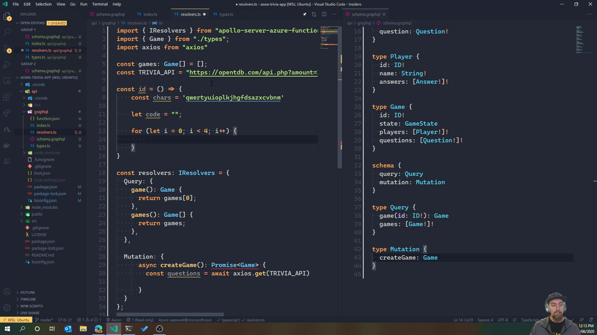

# Trivia App Demo

This repo contains a demo application for [Azure Static Web Apps (Preview)](https://docs.microsoft.com/azure/static-web-apps/?WT.mc_id=staticwebapps-github-aapowell) which consists of a Trivia Game, backed by [Open Trivia DB](https://opentdb.com/).

You can find a deployed version of the application at https://trivia-app.aaron-powell.com/.

## How to play

To play to game, click "Start new game", enter your name, answer the questions and see how well you did. Each question will have 30 seconds until it times out and moved on to the next one. The questions are in the "hard" category of "Science and Technology" from Open Trivia DB.

## Anatomy of the app

The application consists ofr two components, a web front end and a serverless backend. All components are within this repo so you can run it all together.

### Web Front End

The web front end is written using [Create React App](https://create-react-app.dev/) using the [TypeScript template](https://create-react-app.dev/docs/adding-typescript).

You'll find the code starting in the root of the git repo, with the code then residing within [`/src`](/src) with each of the difference pages in the `pages` folder.

To communicate with the backend, [Apollo Client for React](https://www.apollographql.com/docs/react/) is used, leveraging the React Hooks.

### Serverless Backend

The backend is written using [Azure Functions](https://docs.microsoft.com/azure/functions/?WT.mc_id=staticwebapps-github-aapowell), using the TypeScript template, and exposes the data via [GraphQL](https://graphql.org/) using [Apollo Server for Azure Functions](https://www.apollographql.com/docs/apollo-server/deployment/azure-functions/). Presently, there's no database backend, the data is stored temporarily in memory.

## Learn how to build it

I did a live stream where we built the whole thing from scratch, you can watch it on YouTube

## Additional Exercises

If you want to look at wats to expand the application, there's a few opportunities:

- Improve the UI
- Add a proper database backend, such as [Cosmos DB's free tier](https://docs.microsoft.com/azure/cosmos-db/optimize-dev-test?WT.mc_id=staticwebapps-github-aapowell#azure-cosmos-db-free-tier)
- Make the game multi-player. The data structures are designed for multi-player, but the application doesn't support it presently
